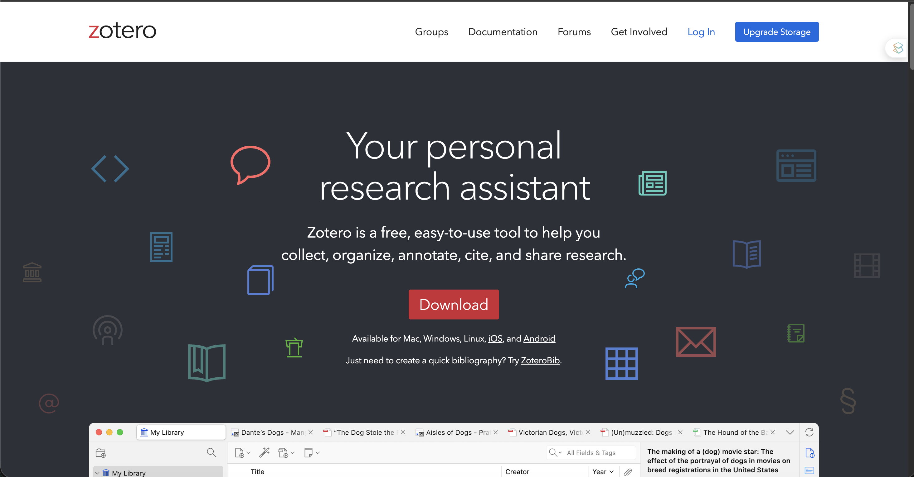
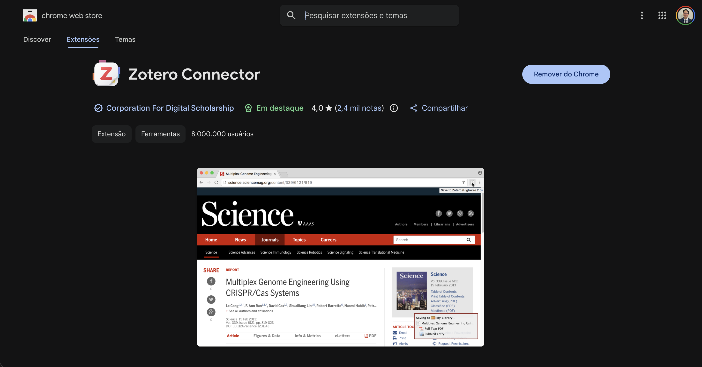
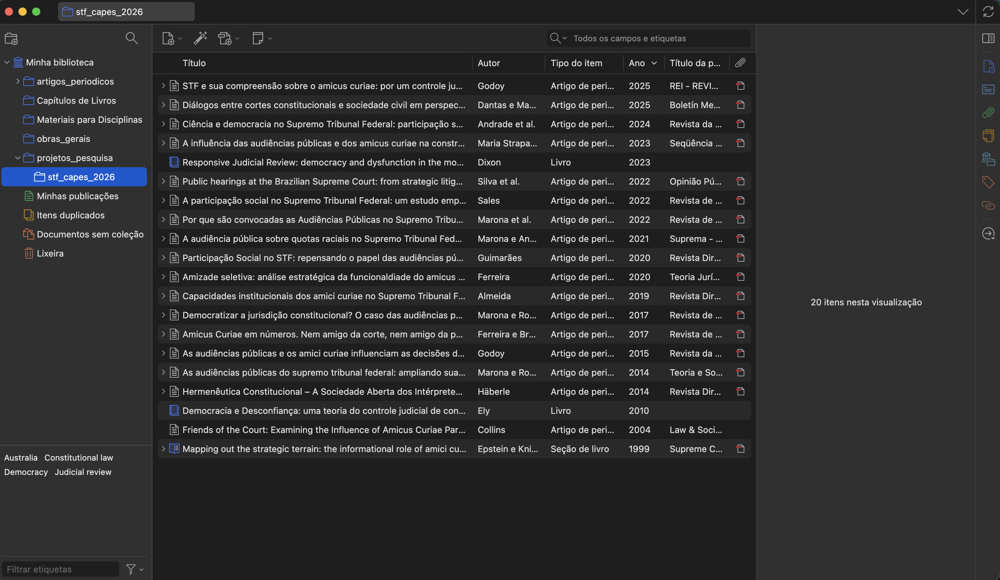
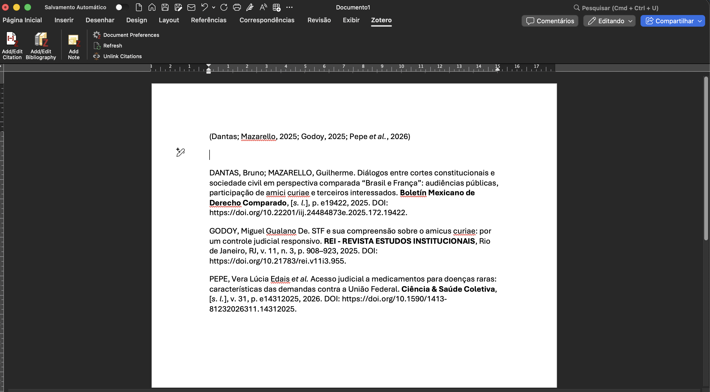
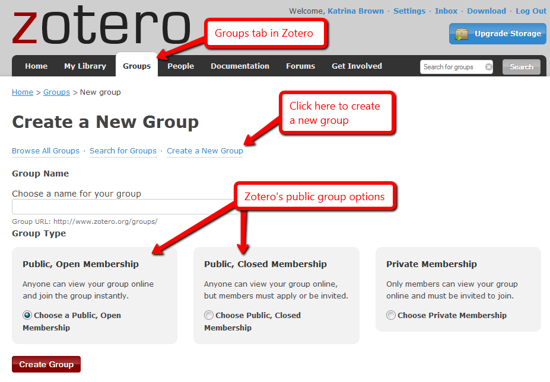

## E agora, onde guardar tudo isso?

- Referências acumuladas em arquivos, e-mails e abas do navegador
- PDFs perdidos em pastas com nomes intratáveis
- Retrabalho a cada formatação de citação
- Normas inconsistentes entre capítulos
- Coautores enviando bibliografias em formatos diferentes 😵‍💫

------------------------------------------------------------------------

## O que é um gerenciador de referências?

::::: columns
::: {.column width="50%"}
**Quatro funções centrais**

- **Coletar** metadados e PDFs
- **Organizar** por projeto e tema
- **Citar** dentro do texto
- **Compartilhar** com coautores
:::

::: {.column width="50%"}
**Fluxo típico**

- Captura no navegador
- Organização em coleções
- Escrita com citação automática
- Publicação com referências consistentes
:::
:::::

------------------------------------------------------------------------

## Panorama das ferramentas

| Ferramenta | Licença | Armazenamento gratuito | Integração com editores | Open source |
|---------------|---------------|---------------|---------------|---------------|
| Zotero | Gratuita | 300 MB | Word, LibreOffice, Google Docs | Sim |
| Mendeley | Gratuita (Elsevier) | 2 GB | Word, LibreOffice | Não |
| EndNote | Comercial | — | Word | Não |
| JabRef | Gratuita | Local | LaTeX (BibTeX) | Sim |

::: {style="font-size: 0.7em; color: #5f6b76; text-align: center; margin-top: 1em;"}
**Foco desta apresentação: Zotero** — equilíbrio entre liberdade, recursos e comunidade.
:::

------------------------------------------------------------------------

## Por que o Zotero?

- **Gratuito e open source**, mantido por organização sem fins lucrativos (Corporation for Digital Scholarship) — sem vínculo com editora comercial
- **Multiplataforma**: Windows, macOS, Linux, iOS e Android
- **Ecossistema de plugins** extensível: ABNT, Better BibTeX, Zotero Citation Counts, ZotFile, entre outros

------------------------------------------------------------------------

## Como o Zotero funciona

::::: columns
::: {.column width="45%"}
**Arquitetura**

- App desktop (biblioteca local)
- Connector (extensão do navegador)
- Sincronização em nuvem
- Plugin no processador de texto
:::

::: {.column width="55%"}
{width="100%" fig-align="center"}

::: {style="font-size: 0.8em; color: #5f6b76; text-align: center; margin-top: 0.3em;"}
Interface principal do Zotero 7
:::
:::
:::::

------------------------------------------------------------------------

## Captura com um clique

::::: columns
::: {.column width="50%"}
**Connector no navegador**

- Detecta páginas de periódicos, Google Scholar, catálogos
- Salva metadados + PDF automaticamente

**Outras formas**

- ISBN, DOI ou PMID via "Adicionar item por identificador"
- Arrastar PDF (recupera metadados)
- Importar RIS, BibTeX, MARC
:::

::: {.column width="50%"}
{width="100%" fig-align="center"}

::: {style="font-size: 0.8em; color: #5f6b76; text-align: center; margin-top: 0.3em;"}
Funcionamento do Zotero Connector
:::
:::
:::::

------------------------------------------------------------------------

## Organização da biblioteca

::::: columns
::: {.column width="50%"}
**Recursos**

- Coleções (pastas) por projeto
- Tags para temas transversais
- Busca avançada com filtros
- Marcadores de leitura e itens relacionados
:::

::: {.column width="50%"}
{width="100%" fig-align="center"}

::: {style="font-size: 0.8em; color: #5f6b76; text-align: center; margin-top: 0.3em;"}
Interface de Biblioteca do Zotero
:::
:::
:::::

------------------------------------------------------------------------

## Leitura e anotação integrada

::::: columns
::: {.column width="50%"}
**Leitor nativo (Zotero 7)**

- PDF, ePUB e HTML
- Destaques com cores
- Notas marginais e comentários
- Extração automática para nota
:::

::: {.column width="50%"}
{width="100%" fig-align="center"}

::: {style="font-size: 0.8em; color: #5f6b76; text-align: center; margin-top: 0.3em;"}
Painel de Leitura do Zotero
:::
:::
:::::

------------------------------------------------------------------------

## Integração com processadores de texto

::::: columns
::: {.column width="50%"}
**Plugins instalados por padrão**

- Word, LibreOffice e Google Docs
- Inserção de citação in-text
- Geração automática de referências
- Mais de 9.000 estilos disponíveis
:::

::: {.column width="50%"}
{width="100%" fig-align="center"}

::: {style="font-size: 0.8em; color: #5f6b76; text-align: center; margin-top: 0.3em;"}
Integração do Zotero com o Word
:::
:::
:::::

------------------------------------------------------------------------

## Estilos brasileiros (ABNT)

- Instalação pelo repositório oficial: **Zotero → Preferências → Citação → Obter estilos adicionais**
- Buscar por **ABNT (NBR 6023)**
- Verificar a versão disponível — a NBR 6023 sofre atualizações e é preciso ter atenção a isso
- Ajustes manuais podem ser necessários em casos específicos
- **ZoteroBib** (zbib.org): alternativa simplificada para trabalhos pontuais, sem instalar nada

------------------------------------------------------------------------

## Colaboração e sincronização

::::: columns
::: {.column width="50%"}
**Bibliotecas de grupo**

- Sem limite de colaboradores no plano gratuito
- Grupos de pesquisa, orientação, disciplinas
- Armazenamento: 300 MB gratuitos
- Alternativa **WebDAV** para contornar o limite
:::

::: {.column width="50%"}
{width="100%" fig-align="center"}

::: {style="font-size: 0.8em; color: #5f6b76; text-align: center; margin-top: 0.3em;"}
Como Montar Grupos no Zotero
:::
:::
:::::

------------------------------------------------------------------------

## Integração com fluxos avançados de escrita

::::: columns
::: {.column width="50%"}
**Fluxo padrão**

- Zotero → Word
- Zotero → LibreOffice
- Zotero → Google Docs

*Maioria dos usuários*
:::

::: {.column width="50%"}
**Fluxo avançado**

- Zotero + **Better BibTeX**
- LaTeX, Quarto, R Markdown
- Chaves de citação estáveis
- Exportação BibTeX/BibLaTeX
- Integração nativa com RStudio/Positron
:::
:::::

------------------------------------------------------------------------

## Resumo: o que o Zotero resolve

- **Captura automática** — fim do copia-e-cola de metadados
- **Organização por projeto** — coleções, tags, busca
- **Citação sem retrabalho** — troca de estilo em um clique
- **Colaboração gratuita** — bibliotecas de grupo ilimitadas
- **Portabilidade** — formatos abertos, sem aprisionamento

------------------------------------------------------------------------

## Hora de botar a mão na massa!!!

::: {style="text-align: center; margin-top: 0%;"}
{width="100%"}
:::